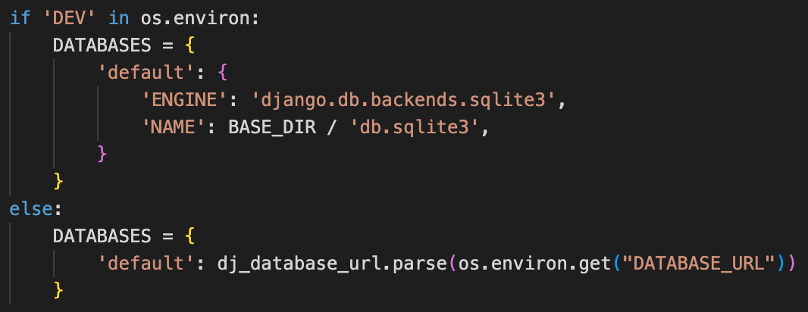

# Cosplay Mania

Welcome to Cosplay Mania!

Cosplay Mania is a photo-sharing platform for the wonderful world of cosplay! Users can share their latest and most unique cosplaying experiences through posts, as well as interact with each other through like, comment, and follow functionalities. This is the backend repository of the Cosplay Mania project which is supported by Django REST framework. The frontend repository of the project can be accessed [HERE](https://github.com/Lapratomo24/cosplay-mania).

[Deployed API](https://react-project-5.herokuapp.com/)

[Deployed Site](https://cosplay-mania.herokuapp.com/)

## Figma Database

## Project Setup

- django-admin startproject cosplay-mania .

### pip install

- 'django<4'
- django-cloudinary-storage
- Pillow
- djangorestframework
- django-filter
- dj-rest-auth
- 'dj-rest-auth[with_social]'
- djangorestframework-simplejwt
- dj-database-url
- gunicorn
- django-cors-headers

### settings.py

<b>Imports</b>

 

<b>Cloudinary</b>

 

<b>REST Framework</b>

 

<b>Authorization</b>

 

<b>Client-Origin</b>

 

<b>Installed Apps</b>

 

<b>Middleware</b>

 

<b>database</b>

 

### Procfile and Migration

python3 manage.py makemigrations
python3 manage.py migrate
pip3 freeze --local > requirements.txt

### Heroku Settings

## Testing

### CI Python Linter

Other than such "errors" as shown below, all my code is shown to be clean.

### Manual Testing

**Profiles**

I confirm that the Profiles section displays the different states based on whether a superuser (admin) is logged in or not, and whether they are the owner of the profile or otherwise.

<b>Profile Detail: Owner</b>

 

<b>Profile Detail: Not Owner</b>

 

<b>Profile Not Found</b>

 

**Posts**

I confirm that the Posts section displays the different states based on whether a user owns the post(s) or doesn't, such as the ability to edit or delete a post. Moreover, if an uploaded image size is too big or if the post title is blank, the user will get an error message.

<b>Post Detail: Owner</b>

 

<b>Blank Title</b>

 

<b>Post Not Found</b>

 

<b>Post Image Size</b>

 

**Likes**

I confirm that the Likes section displays the different states based on whether a user likes a post or doesn't, such as the ability delete the like. Moreover, if a like is posted, the like count on the post is updated (shown in the comments section below).

<b>Like Detail: Owner</b>

 

<b>Like Detail: Not Owner</b>

 

**Comments**

I confirm that the Comments section displays the different states based on whether a user owns the comment(s) or doesn't, such as the ability to edit or delete a comment. Moreover, if a comment is posted, the comment count on the post list is updated.

<b>Comment Detail: Owner</b>

 

<b>Comment Detail: Not Owner</b>

 

<b>Comment on Post List</b>

 

**Followers**

I confirm that the Followers section displays the different states based on whether a user owns the comment(s) or doesn't, such as the ability to delete a follow. Moreover, if a follow is posted, the follower/following count on the profile list is updated.

<b>Follower Detail: Owner</b>

 

<b>Follower Detail: Not Owner</b>

 

<b>Follower on Profile List</b>

 

## Technologies

### Language, frameworks, modules, libraries

- Python.
- [Django](https://www.djangoproject.com/): Python web framework that encourages rapid development for this project.
- [DRF](https://www.django-rest-framework.org/): Django REST Framework is a powerful and flexible toolkit for building Web APIs.
- [os](https://docs.python.org/3/library/os.html): Module that provides a portable way of operating system dependent functionality.
- [dj-database-url](https://pypi.org/project/dj-database-url/): Allows the use of DATABASE_URL environment variable to configure Django application.
- [gunicorn](https://gunicorn.org/): Python WSGI HTTP Server.
- [psycopg2](https://pypi.org/project/psycopg2/): PostgreSQL database adapter for Python.
- [CORS-headers](https://pypi.org/project/django-cors-headers/): Django app for handling the server headers required for Cross-Origin Resource Sharing.

### Programs

- [ElephantSQL](https://www.elephantsql.com/): Open source object-relational database system.
- [Heroku](https://www.heroku.com/): Cloud platform used for the project deployment that lets companies build, deliver, monitor and scale apps.
- [GitHub](https://github.com/): Code hosting platform for version control and collaboration.
- [Gitpod](https://www.gitpod.io/): An IDE to create and develop this project.
- [Cloudinary](https://cloudinary.com): End-to-end image and video hosting solution for websites and mobile apps.

## Deployment

For this final milestone project, Heroku is used for the deployment of the application.

1. After logging in, click the New button on the top right.
2. From the dropdown, click Create new app.
3. Type in a relevant name, choose your region, then click Create app button.
4. Go to Resources tab, and type in Postgres under add-ons to select Heroku Postgres (database moved to ElephantSQL).

5. Back on GitHub, launch Gitpod then install and add the following apps on settings.py:
    - 'cloudinary_storage',
    - 'cloudinary',
    - 'rest_framework',
    - 'django_filters',
    - 'rest_framework.authtoken',
    - 'dj_rest_auth',
    - 'django.contrib.sites',
    - 'allauth',
    - 'allauth.account',
    - 'allauth.socialaccount',
    - 'dj_rest_auth.registration',
    - 'corsheaders',

6. Create a Django project via the command 'django-admin startproject new_project'.
7. Back on Heroku, add several Config Vars:
    - ALLOWED HOST
    - CLIENT_ORIGIN
    - CLIENT_ORIGIN_DEV
    - CLOUDINARY_URL
    - DATABASE_URL
    - DISABLE_COLLECTSTATIC
    - SECRET_KEY

8. Back on GitHub again, create an env.py file and add the necessary variables:
    - os.environ["DEV"] = “True”
    - os.environ["SECRET_KEY"]
    - os.environ["CLOUDINARY_URL"]
    - os.environ["CLIENT_ORIGIN"]
    - os.environ["CLIENT_ORIGIN_DEV"]
    - os.environ["DATABASE_URL"]

9. As shown in the Project Setup above, update settings.py file as per the instructions from Moments walkthrough.
10. Migrate the updated database and freeze the requirements.
11. Git add, commit, and push the changes.
12. Back on Heroku again, go to Deploy tab and choose GitHub as your Deployment method.
13. Connect to GitHub by clicking the Search button and choosing the correct repository.
14. You can now choose between Enable Automatic Deploys or manually deploy the application via Deploy Branch. After Heroku finishes building the application, you can click the View button to launch and run your terminal on a new tab.

**GitHub**

Forking the Repository:

- Locate the repository.
- Locate the 'Fork' button on the right side of the page. Clicking the button results in the creation of a copy of the repository.
- The copy is now found in your GitHub account.

Cloning the Repository:

- Locate the repository.
- Click the 'Code' button to the left of the green 'Gitpod' button.
- Copy the link under HTTPS by clicking the clipboard icon.
- Open Git Bash.
- Change the current working directory to the location where you want the cloned directory to be made.
- Type git clone and then paste the copied link form GitHub.
- Pressing 'Enter' will result in the creation of the local clone.

## Credits and Acknowledgements

Admittedly, this final project is perhaps the most difficult learning experience I've ever had since I decided to learn how to code more than one year ago. It's safe to say that I did not manage to comprehend the inner workings of React and therefore found myself relying 100% on the Moments walkthrough for both the backend and frontend parts of this project. So I would like to say thank you to CodeInstitute for the guidance to get me through this difficult period. I am also grateful to the tutors who helped me during the difficulties I faced during the creation of this project.

---

Looking forward to my Diploma! (fingers crossed that I do not fail this project)

